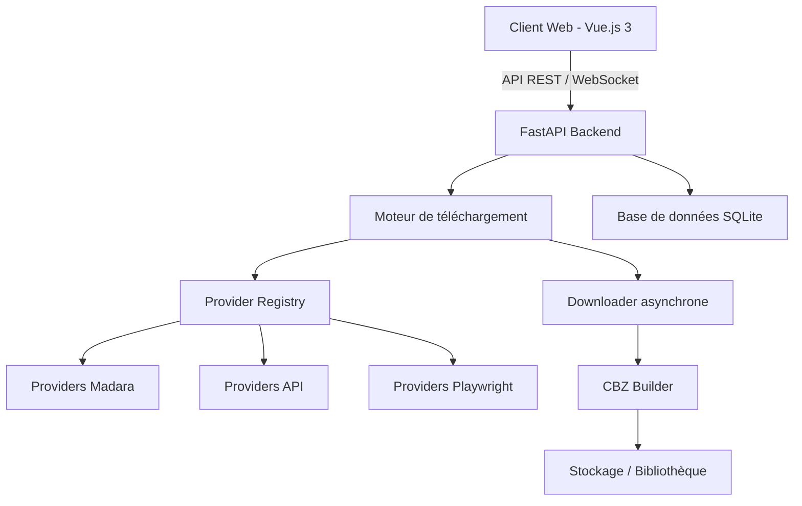

# 🧬 NexusDL 2.0

> **Le téléchargement de scans, réinventé en architecture Nexus.**

[](https://fastapi.tiangolo.com/)
[](https://vuejs.org/)
[](https://www.docker.com/)
[](https://www.gnu.org/licenses/gpl-3.0)
[](https://python.org/)
[](https://playwright.dev/)

---

## 📖 À propos

**NexusDL** est un serveur web modulaire et ultra-performant permettant d'analyser, de gérer et de télécharger automatiquement des **mangas**, **manhwas**, **webtoons** et **doujinshi** depuis plus de **50 sites de scan** (français, anglais et internationaux).

Conçu avec une architecture asynchrone de nouvelle génération, il transforme votre navigateur en une véritable **bibliothèque personnelle** de scans, avec export au format **CBZ** (prêt pour lecteurs comme CDisplayEx, Komikku, ou YACReader).

> ⚠️ **Disclaimer** : Ce projet est développé à **but strictement éducatif** et pour une utilisation **personnelle**. L'utilisation de cet outil pour télécharger du contenu protégé par des droits d'auteur est de votre seule responsabilité. Respectez les lois en vigueur dans votre pays et les conditions d'utilisation des sites sources.

---

## ✨ Fonctionnalités principales

| Fonctionnalité | Description |
|----------------|-------------|
| 🌍 **50+ Providers** | Support de SushiScan, Scan-Manga, MangaDex, Asura Scans, Hentaizone, nHentai, et bien d'autres. |
| ⚡ **Architecture asynchrone** | Téléchargement parallèle des images via `aiohttp` pour une vitesse maximale. |
| 🎨 **Interface Web moderne** | Construite avec **Vue.js 3** (Composition API) et **SCSS**, avec thème clair/sombre. |
| 📦 **Export CBZ** | Génération de fichiers `.cbz` optimisés avec métadonnées **ComicInfo.xml** (titre, auteur, description). |
| 🛡️ **Support Playwright** | Gère les sites utilisant JavaScript lourd, Cloudflare ou des protections anti-bot. |
| 🔞 **Support mixte SFW/NSFW** | Filtrage et gestion du contenu pour adulte (configurable). |
| 🐳 **Prêt pour Docker** | Déploiement en production en **2 commandes** (`make build && make up`). |
| 🔐 **Authentification JWT** | Sécurisation de l'API avec tokens d'accès et de rafraîchissement. |
| 📡 **WebSockets temps réel** | Mises à jour instantanées de la file d'attente et des téléchargements. |
| 📊 **Gestion de bibliothèque** | Recherche, tri et visualisation de tous vos téléchargements. |

---

## 🖼️ Aperçu

*(Ajoutez ici une capture d'écran de l'interface)*

---

## 📋 Liste des providers intégrés

### 🇫🇷 Sites Français (26) - Thème Madara
```
sushiscan.net, scan-manga.com, toonfr.com, anime-scans.com, ortegascans.com,
crunchyscan.fr, mangas-origines.fr, toongod.org, phenix-scans.co,
poseidon-scans.net, raijin-scans.fr, rimuscan.fr, blossom-scans.com,
x-manga.net, x-manga.org, manhwaclub.net, epsilonscan.to, manhwa-raw.com,
genkan-scans.com, nekohouse.fr, shinra-scans.fr, taisei-scans.com,
fandub-scans.com, karma-scans.com, urano-scans.fr, xanadu-scans.fr
```

### 🌍 Sites Internationaux (16) - Thème Madara
```
mangakakalot.com, bato.to, comick.io, asurascans.com, flamescans.org,
reaperscans.com, luminousscans.com, void-scans.com, tcbscans.com,
mangasee123.com, galaxy-scans.com, zenith-scans.com, leviathanscans.com,
disasterscans.com, kireicake.com, scyllascans.com
```

### 🧬 Sites Spéciaux (API / JS)
```
MangaDex (api.mangadex.org) - API REST
Hentaizone (hentaizone.xyz) - Playwright (JS) - ADULT
nHentai (nhentai.net) - API officieuse - ADULT
Pururin (pururin.com) - Madara + Playwright - ADULT
```

---

## 🚀 Démarrage rapide

### Prérequis

- **Docker** & **Docker Compose** (recommandé)
- *OU* Python 3.10+ et Node.js 20+ (pour développement local)

### Avec Docker (Production)

```bash
# 1. Cloner le dépôt
git clone https://github.com/ton-pseudo/nexus-dl.git
cd nexus-dl

# 2. Construire les images
make build

# 3. Lancer les services
make up

# 4. Accéder à l'interface
# Frontend : http://localhost
# API Docs : http://localhost/docs
```

### Avec Makefile (Commandes utiles)

| Commande | Description |
|----------|-------------|
| `make help` | Afficher l'aide de toutes les commandes |
| `make install` | Installer les dépendances Python et Node.js |
| `make build` | Construire les images Docker (sans cache) |
| `make up` | Démarrer les services en arrière-plan |
| `make down` | Arrêter les services |
| `make dev` | Démarrer en mode développement (logs en direct) |
| `make logs` | Voir les logs des conteneurs |
| `make clean` | Nettoyage complet (conteneurs, volumes, données) |
| `make restart` | Redémarrer les services |
| `make shell-backend` | Ouvrir un shell dans le conteneur backend |
| `make shell-frontend` | Ouvrir un shell dans le conteneur frontend |

### Installation locale (Développement)

```bash
# Backend
cd backend
python -m venv venv
source venv/bin/activate  # Sur Windows: venv\Scripts\activate
pip install -r requirements.txt
playwright install chromium
uvicorn app.main:app --reload

# Frontend (dans un nouveau terminal)
cd frontend
npm install
npm run dev
```

---

## ⚙️ Configuration

Toutes les variables d'environnement sont définies dans le fichier `.env` à la racine du projet.

| Variable | Description | Valeur par défaut |
|----------|-------------|-------------------|
| `ENV` | Environnement (`development` ou `production`) | `production` |
| `SECRET_KEY` | Clé secrète pour JWT (à changer en production) | `change-me-in-production` |
| `DATABASE_URL` | URL de la base de données | `sqlite:///./data/nexus.db` |
| `MAX_THREADS` | Nombre de téléchargements parallèles | `10` |
| `DOWNLOAD_TIMEOUT` | Timeout des requêtes (secondes) | `30` |
| `CACHE_ENABLED` | Activer le cache des pages | `true` |
| `RATE_LIMIT_ENABLED` | Activer la limitation de débit | `true` |
| `CORS_ORIGINS` | Origines autorisées pour CORS | `["http://localhost:5173","http://localhost"]` |

---

## 🏗️ Architecture technique



### Stack Backend
- **Framework** : FastAPI (asynchrone)
- **HTTP Client** : aiohttp
- **Parsing** : BeautifulSoup4 + lxml
- **Browser Automation** : Playwright
- **ORM** : SQLAlchemy (pour la persistance)
- **Auth** : python-jose + passlib

### Stack Frontend
- **Framework** : Vue.js 3 (Composition API)
- **State Management** : Pinia
- **Routing** : Vue Router
- **HTTP Client** : Axios
- **Build Tool** : Vite
- **Styling** : SCSS (BEM methodology)

---

## 📚 Documentation API

Une fois le serveur démarré, la documentation interactive est disponible à l'adresse :

- **Swagger UI** : [http://localhost/docs](http://localhost/docs)
- **ReDoc** : [http://localhost/redoc](http://localhost/redoc)

### Endpoints principaux

| Méthode | Endpoint | Description |
|---------|----------|-------------|
| `GET` | `/api/providers` | Liste tous les providers disponibles |
| `POST` | `/api/analyze` | Analyse une URL pour extraire les métadonnées |
| `POST` | `/api/download` | Lance un téléchargement |
| `GET` | `/api/jobs` | Liste les jobs actifs |
| `GET` | `/api/library` | Liste la bibliothèque |
| `DELETE` | `/api/library/{id}` | Supprime un élément de la bibliothèque |
| `WS` | `/api/ws` | WebSocket pour les mises à jour temps réel |

---

## 🔧 Dépannage

### Problème : Les providers ne chargent pas
- Vérifiez votre connexion Internet.
- Assurez-vous que Playwright est installé : `playwright install chromium`.
- Consultez les logs : `make logs`.

### Problème : Les images ne s'affichent pas dans le frontend
- Vérifiez que les CORS sont correctement configurés.
- Assurez-vous que le frontend pointe vers la bonne URL de backend (variable `VITE_API_BACKEND_URL`).

### Problème : Erreur de permission SQLite
- Assurez-vous que le dossier `data/` a les bonnes permissions (`chmod 755 data/`).

---

## 🤝 Contribution

Les contributions sont les bienvenues ! Pour contribuer :

1. Forkez le projet.
2. Créez votre branche de fonctionnalité (`git checkout -b feature/amazing-feature`).
3. Commitez vos changements (`git commit -m 'Add some amazing feature'`).
4. Pushez vers la branche (`git push origin feature/amazing-feature`).
5. Ouvrez une Pull Request.

Merci de respecter les conventions de code :
- Python : **PEP8**
- Vue.js : **Composition API**
- SCSS : **BEM**

---

## 📄 Licence

Distribué sous la licence **GNU General Public License v3.0**. Voir le fichier `LICENSE` pour plus de détails.

---

## 🙏 Remerciements

- [FastAPI](https://fastapi.tiangolo.com/) pour ce framework incroyable.
- [Vue.js](https://vuejs.org/) pour la réactivité et l'élégance.
- La communauté des scans pour leur travail de traduction et de partage.

---

## ⭐ Soutien

Si ce projet vous est utile, n'oubliez pas de mettre une étoile ⭐ sur GitHub !

---

**Fait avec ❤️ par la communauté NexusDL.**
```
